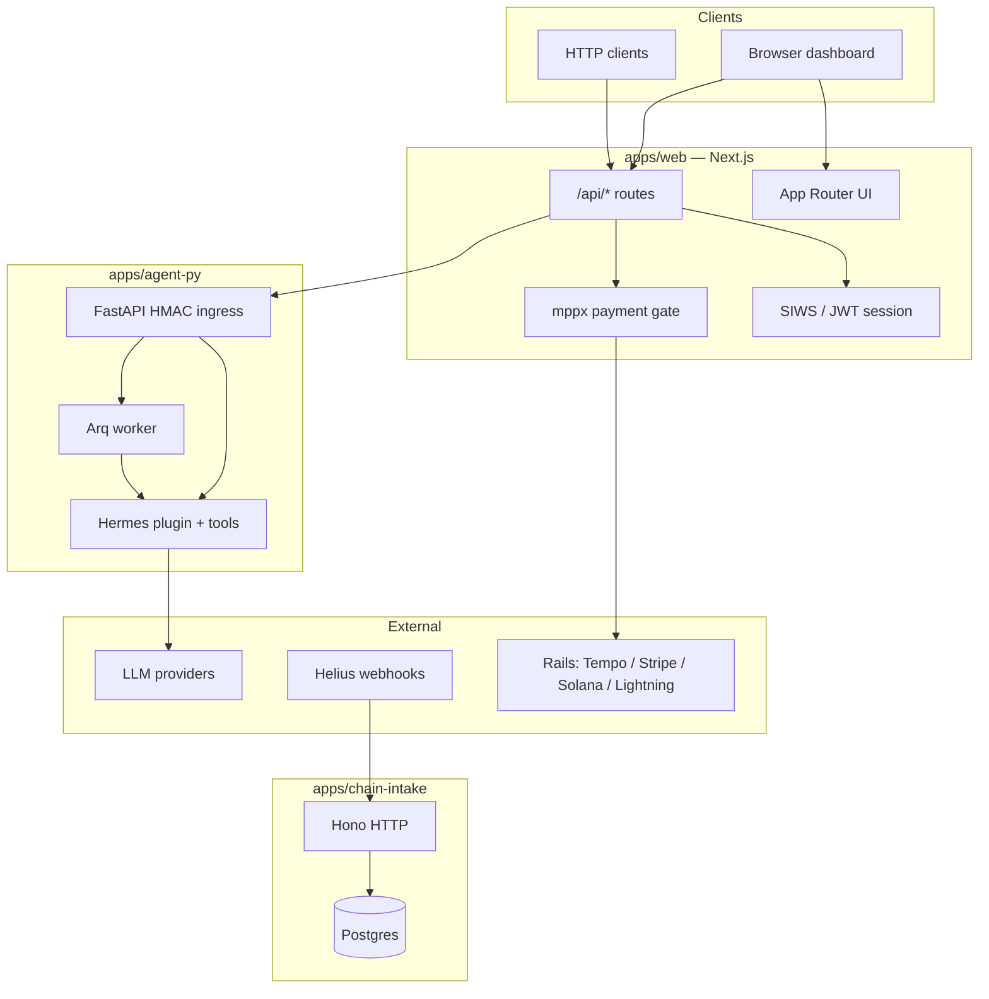

# ARES / ASST — High-level and low-level architecture

This document summarizes how the monorepo is structured: what runs where, how components talk to each other, and where important logic lives in the tree.

**Related:** [REPO_MAP.md](./REPO_MAP.md) (directory index) · [ARCHITECTURE.en.md](./ARCHITECTURE.en.md) (hub → whitepaper §9) · [design/public-web-auth-billing.md](./design/public-web-auth-billing.md) · [WHITEPAPER.en.md §9](./WHITEPAPER.en.md#9-architecture)

---

## 1. High-level architecture

### 1.1 System context

The workspace delivers **Solana-focused security assurance**: a **multi-agent orchestrator** in **`apps/agent-py`** (Hermes + LiteLLM + assurance tools + optional Supabase KB) reasons over a repository, delegates to specialized sub-agents, runs tools, and persists transcripts under `<repo>/.asst/`. **Next.js** (`apps/web`) exposes the public HTTP API and proxies signed JSON to the Python service.

| Surface | Role | Typical users |
|--------|------|----------------|
| **apps/web** (`@asst/web`) | Next.js **dashboard** + **public HTTP API** (`/api/*`) | Browser UI, external clients |
| **apps/agent-py** | **FastAPI** + **Arq** worker + Hermes plugin (chat, scans, KB) | Proxied from web; operators / CI |
| **apps/chain-intake** (`@asst/chain-intake`) | **Helius webhook** ingest → **Postgres** | Backend / automation |

**deepagentsjs/** is a **separate LangGraph-focused tree** (examples, evals, provider adapters). It is useful as a pattern reference and for assurance-run manifest flows; production orchestration is **not** implemented there.

### 1.2 Logical diagram

### 1.3 Trust boundaries (high level)

1. **Public web (`apps/web`)** — Untrusted callers may hit `/api/chat` and `/api/scan`. The app enforces **ingress policy**, **rate limits**, **optional SIWS identity**, **free-tier quotas**, and **per-request payment (mppx)** before forwarding work to **agent-py**. **Mutating tools** stay off unless explicitly enabled for trusted deployments.
2. **Operator / internal** — Optional **API key** paths bypass some gates for automation (documented in route handlers).
3. **agent-py** — Validates **HMAC** on proxied bodies; should run behind private network or authenticated gateway in production.
4. **Chain intake** — **Webhook secret** (Bearer) validates Helius deliveries before persistence.

---

## 2. Low-level architecture

### 2.1 Monorepo layout (pnpm)

- **Workspace roots:** `packages/*`, `apps/*` ([pnpm-workspace.yaml](../pnpm-workspace.yaml)).
- **Primary build/test targets** (root `package.json`): `@asst/web`, `@asst/chain-intake` (see [.github/workflows](../.github/workflows/) for **agent-py** CI).

### 2.2 `apps/agent-py`

| Layer | Responsibility | Key locations |
|-------|----------------|---------------|
| **HTTP** | `/v1/chat`, `/v1/scan`, `/v1/feedback`, … | `src/ares_plugin/api/main.py` |
| **Orchestration** | Routing + sub-agent fan-out | `src/ares_plugin/orchestrator.py` |
| **Sub-agents** | Prompts + tool allowlists | `src/ares_plugin/sub_agents.py` |
| **Tools** | Assurance + KB tools | `src/ares_plugin/tools/*` |
| **Queue** | Arq jobs for scans | `src/ares_plugin/arq_worker.py` |
| **Persistence** | JSONL chat / scan pointers | `src/ares_plugin/persistence.py` |

### 2.3 `apps/web` (`@asst/web`)

| Area | Responsibility | Key locations |
|------|----------------|---------------|
| **API routes** | Chat, scan, auth, billing, admin | `app/api/**/route.ts` |
| **agent-py client** | HMAC-signed JSON to `AGENT_PY_URL` | `lib/agentpy-client.ts` |
| **Model hygiene** | Strip `@baseUrl` from public `model` | `lib/auth/sanitize-model.ts` |
| **Auth** | SIWS / JWT session material | `lib/auth/*` |
| **Billing / quotas** | Free-tier consumption (Postgres); **paid path via mppx** | `lib/billing/quota.ts`, `lib/payments/mppx.ts` |
| **DB** | Postgres pool for dashboard + quotas | `lib/db/pool.ts` |
| **Rate limits** | IP / wallet limits | `lib/ratelimit/*`, `lib/api.ts` |

**Paid API flow (simplified):**

- **`POST /api/chat`** — After ingress + limits + optional free tier → **`mppx.compose`** … then proxy to **`/v1/chat`**.
- **`POST /api/scan`** — Session + quota → mppx → fire-and-forget **`/v1/scan`**.

Legacy **bundle top-up** routes return **410 Gone**; ledger writes for debits were removed in favor of inline settlement.

### 2.4 `apps/chain-intake` (`@asst/chain-intake`)

| Piece | Responsibility |
|-------|------------------|
| **HTTP** | Hono app (`src/server.ts`) |
| **Auth** | `Authorization: Bearer <WEBHOOK_SHARED_SECRET>` (constant-time compare) |
| **Ingest** | Parse Helius payloads → normalized rows | `src/ingest.ts` |
| **DB** | Postgres via pool | `src/db.ts` |

On-chain events are stored for **analytics / triggers / discovery**; they are **not** the source of truth for per-request web billing (that is **mppx** on `apps/web`).

### 2.5 Configuration and secrets (conceptual)

- **Root / app `.env`:** LLM keys, `DATABASE_URL`, session secrets, mppx `MPP_SECRET_KEY`, Tempo/Stripe/Solana/Lightning vars, webhook secret, **`AGENT_PY_URL` / `AGENTPY_INTERNAL_SECRET`**, optional Supabase KB keys. See [.env.example](../.env.example).
- **agent-py:** `AGENTPY_*` prefix for service config; see [apps/agent-py/README.md](../apps/agent-py/README.md).

---

## 3. Request path cheat sheet

| User action | Entry | Downstream |
|-------------|-------|------------|
| Dashboard chat | `POST /api/chat` | Quotas → mppx → `agentPyPostJson` → **`POST /v1/chat`** |
| Dashboard scan | `POST /api/scan` | Session + quota → mppx → **`POST /v1/scan`** (queued) |
| Chain indexing | Helius → webhook | `chain-intake` → Postgres |

---

## 4. Technology stack (summary)

- **Languages:** TypeScript (web + intake), Python (agent-py)
- **Web:** Next.js (App Router), React, Tailwind
- **Agent:** Hermes Agent + LiteLLM ([apps/agent-py/README.md](../apps/agent-py/README.md))
- **Persistence:** JSONL under `.asst/` (agent transcripts), Postgres (web + intake), optional Supabase (KB only)
- **Payments:** [mppx](https://mpp.dev) (HTTP 402 + machine payments) with optional Tempo, Stripe, Spark Lightning, Solana (env-gated)
- **Webhook server:** Hono (`@hono/node-server`)

---

## 5. Where to go deeper

- **Directory map:** [REPO_MAP.md](./REPO_MAP.md)
- **Product / formal architecture narrative:** [WHITEPAPER.en.md §9](./WHITEPAPER.en.md#9-architecture)
- **Web auth + billing design notes:** [design/public-web-auth-billing.md](./design/public-web-auth-billing.md)
- **Agent service:** [apps/agent-py/README.md](../apps/agent-py/README.md) · [docs/runbooks/agent-py-deploy.md](./runbooks/agent-py-deploy.md)

---

*Internal engineering overview. For threat modeling and security review, use the repository’s dedicated security docs and runbooks.*
