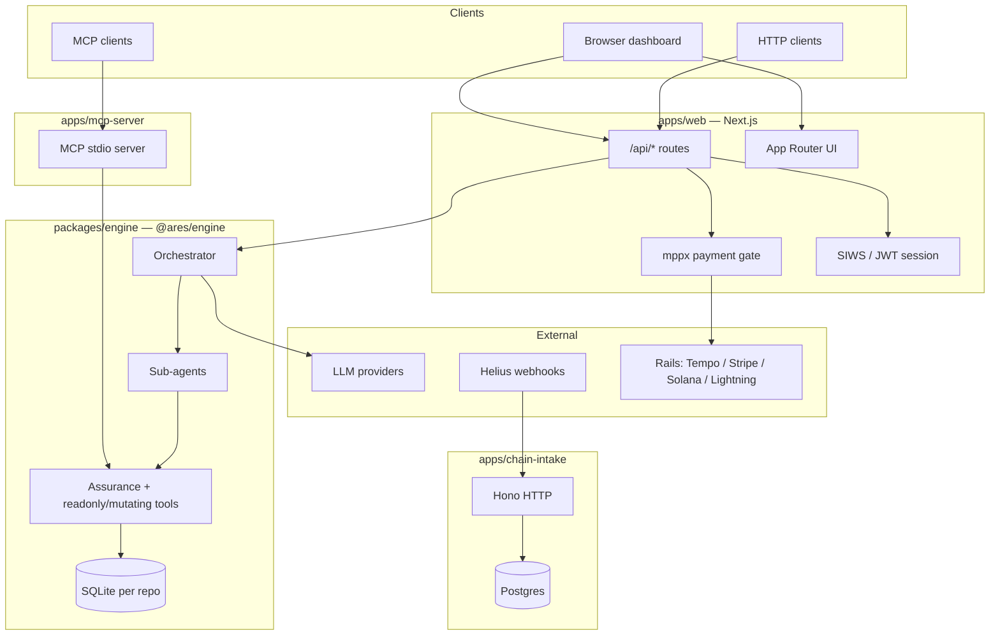

# ARES / ASST — High-level and low-level architecture

This document summarizes how the monorepo is structured: what runs where, how components talk to each other, and where important logic lives in the tree.

**Related:** [REPO_MAP.md](./REPO_MAP.md) (directory index) · [ARCHITECTURE.en.md](./ARCHITECTURE.en.md) (hub → whitepaper §9) · [design/public-web-auth-billing.md](./design/public-web-auth-billing.md) · [WHITEPAPER.en.md §9](./WHITEPAPER.en.md#9-architecture)

---

## 1. High-level architecture

### 1.1 System context

The workspace delivers **Solana-focused security assurance**: a **multi-agent orchestrator** (`@ares/engine`) can reason over a repository, delegate to specialized sub-agents, run tools (static analysis, on-chain reads, reports), and persist run state. That capability is exposed through several **deployable surfaces**:

| Surface | Role | Typical users |
|--------|------|----------------|
| **apps/web** (`@asst/web`) | Next.js **dashboard** + **public HTTP API** (`/api/*`) | Browser UI, external clients |
| **apps/mcp-server** (`@asst/mcp-server`) | **MCP** stdio server (Cursor, Claude Desktop, etc.) | IDE-integrated agents |
| **apps/chain-intake** (`@asst/chain-intake`) | **Helius webhook** ingest → **Postgres** | Backend / automation |
| **packages/engine** (`@ares/engine`) | **Core orchestrator + tools + persistence** | Imported by web and MCP (not deployed alone) |

**deepagentsjs/** is a **separate LangGraph-focused tree** (examples, evals, provider adapters). It is useful as a pattern reference and for assurance-run manifest flows; it is not the same package as `@ares/engine`, though concepts align.

### 1.2 Logical diagram

### 1.3 Trust boundaries (high level)

1. **Public web (`apps/web`)** — Untrusted callers may hit `/api/chat` and `/api/scan`. The app enforces **ingress policy**, **rate limits**, **optional SIWS identity**, **free-tier quotas**, and **per-request payment (mppx)** before running expensive work. **Mutating tools** are restricted on the web surface unless explicitly enabled (see `engine-factory` / env).
2. **Operator / internal** — Optional **API key** paths bypass some gates for automation (documented in route handlers).
3. **MCP server** — Runs locally with stdio; trust is the **user’s machine** and MCP host configuration.
4. **Chain intake** — **Webhook secret** (Bearer) validates Helius deliveries before persistence.

---

## 2. Low-level architecture

### 2.1 Monorepo layout (pnpm)

- **Workspace roots:** `packages/*`, `apps/*` ([pnpm-workspace.yaml](../pnpm-workspace.yaml)).
- **Primary build/test targets** (root `package.json`): `@asst/web`, `@ares/engine`, `@asst/mcp-server`, `@asst/chain-intake`.

### 2.2 `packages/engine` (`@ares/engine`)

| Layer | Responsibility | Key locations |
|-------|----------------|---------------|
| **Orchestration** | Multi-agent routing: LLM decides which sub-agents to invoke | `src/orchestrator.ts` |
| **Sub-agents** | Specialized agents (configs + factories) | `src/sub-agents.ts`, `src/sub-agents/*` |
| **Model** | Provider selection (Gemini, OpenAI, OpenRouter, Ollama, local) | `src/config/model-factory.ts` |
| **Tools** | Read-only vs mutating tool surfaces | `src/tools/readonly.ts`, `src/tools/mutating.ts`, `src/assurance-tools/*` |
| **Skills** | Load canonical markdown skills | `src/skills/loader.ts` → repo `.agents/skills/` |
| **Persistence** | Local SQLite for run/session state | `src/persistence/sqlite.ts` |
| **Public manifest** | Small export for dashboard agent list | `sub-agent-public-manifest` export |

The **Orchestrator** holds a **repo root**, builds an LLM via `createModel`, instantiates **all sub-agents** for that repo, and exposes high-level operations such as **`chat()`** and **`runFullScan()`** (implementation continues in `orchestrator.ts`).

### 2.3 `apps/web` (`@asst/web`)

| Area | Responsibility | Key locations |
|------|----------------|---------------|
| **API routes** | Chat, scan, auth, billing leftovers, admin | `app/api/**/route.ts` |
| **Public orchestrator** | Wraps `@ares/engine` with **read-only-by-default** and **sanitized `model`** | `lib/engine-factory.ts`, `lib/auth/sanitize-model.ts` |
| **Auth** | SIWS / JWT session material | `lib/auth/*` |
| **Billing / quotas** | Free-tier consumption (Postgres); **paid path via mppx** | `lib/billing/quota.ts`, `lib/payments/mppx.ts` |
| **DB** | Postgres pool for dashboard + quotas | `lib/db/pool.ts` |
| **Rate limits** | IP / wallet limits | `lib/ratelimit/*`, `lib/api.ts` |

**Paid API flow (simplified):**

- **`POST /api/chat`** — After ingress + limits + optional free tier → **`mppx.compose`** with Tempo session when a signing key is configured, else charge rails; **402** with `WWW-Authenticate: Payment` until settled.
- **`POST /api/scan`** — Wallet session required for non-operators; free scan quota → else **`mppx.compose`** over all enabled **charge** methods (Tempo, Stripe, Lightning, Solana as configured).

Legacy **bundle top-up** routes return **410 Gone**; ledger writes for debits were removed in favor of inline settlement.

### 2.4 `apps/mcp-server` (`@asst/mcp-server`)

- **Transport:** MCP over **stdio**.
- **Tools:** Registered from **`@ares/engine`** assurance and related tool exports — single source of truth with the engine package (`server.ts` imports tools and wraps them with MCP schemas).

### 2.5 `apps/chain-intake` (`@asst/chain-intake`)

| Piece | Responsibility |
|-------|------------------|
| **HTTP** | Hono app (`src/server.ts`) |
| **Auth** | `Authorization: Bearer <WEBHOOK_SHARED_SECRET>` (constant-time compare) |
| **Ingest** | Parse Helius payloads → normalized rows | `src/ingest.ts` |
| **DB** | Postgres via pool | `src/db.ts` |

On-chain events are stored for **analytics / triggers / discovery**; they are **not** the source of truth for per-request web billing (that is **mppx** on `apps/web`).

### 2.6 Configuration and secrets (conceptual)

- **Root / app `.env`:** LLM keys, `DATABASE_URL`, session secrets, mppx `MPP_SECRET_KEY`, Tempo/Stripe/Solana/Lightning vars, webhook secret. See [.env.example](../.env.example).
- **Engine:** Model default `ASST_ORCHESTRATOR_MODEL`, sandbox and write toggles per engine docs.

---

## 3. Request path cheat sheet

| User action | Entry | Downstream |
|-------------|-------|------------|
| Dashboard chat | `POST /api/chat` | Quotas → mppx → `createPublicOrchestrator` → `Orchestrator.chat` |
| Dashboard scan | `POST /api/scan` | Session + quota → mppx → background `runFullScan` |
| IDE assurance | MCP tool call | `@ares/engine` tool `invoke` |
| Chain indexing | Helius → webhook | `chain-intake` → Postgres |

---

## 4. Technology stack (summary)

- **Language:** TypeScript
- **Web:** Next.js (App Router), React, Tailwind
- **Engine orchestration:** LangChain / LangGraph family (see engine `package.json`)
- **Persistence:** SQLite (engine local state), Postgres (web + intake)
- **Payments:** [mppx](https://mpp.dev) (HTTP 402 + machine payments) with optional Tempo, Stripe, Spark Lightning, Solana (env-gated)
- **Webhook server:** Hono (`@hono/node-server`)

---

## 5. Where to go deeper

- **Directory map:** [REPO_MAP.md](./REPO_MAP.md)
- **Product / formal architecture narrative:** [WHITEPAPER.en.md §9](./WHITEPAPER.en.md#9-architecture)
- **Web auth + billing design notes:** [design/public-web-auth-billing.md](./design/public-web-auth-billing.md)
- **Engine internals:** `packages/engine/README.md` (if present) and source under `packages/engine/src/`

---

*Internal engineering overview. For threat modeling and security review, use the repository’s dedicated security docs and runbooks.*
